<div align="center">

# 🔐 HashServer

### Just-In-Time Hash Database for Memory Integrity Validation

[](https://www.gnu.org/licenses/agpl-3.0)
[](https://dotnet.microsoft.com/)
[](https://github.com/K2/HashServer)

**A Kestrel-based server providing just-in-time (JIT) hash generation for memory integrity checking without database maintenance overhead.**

[Features](#-features) •
[Quick Start](#-quick-start) •
[How It Works](#-how-it-works) •
[Configuration](#%EF%B8%8F-configuration) •
[Usage](#-usage-examples) •
[Contributing](#-contributing)

</div>

---

## 📋 Table of Contents

- [Overview](#-overview)
- [Features](#-features)
- [Architecture](#-architecture)
- [Quick Start](#-quick-start)
- [How It Works](#-how-it-works)
- [Configuration](#%EF%B8%8F-configuration)
- [Usage Examples](#-usage-examples)
- [API Reference](#-api-reference)
- [Troubleshooting](#-troubleshooting)
- [Contributing](#-contributing)
- [License](#-license)

---

## 🎯 Overview

**HashServer** eliminates the traditional burden of maintaining cryptographic hash databases for memory integrity checking. Instead of managing hash databases that require constant updates with every patch or binary change, HashServer **dynamically generates expected hash values on-demand** based on how binaries are loaded into memory.

### 💡 The Problem

Traditional memory integrity checking solutions require:
- ❌ Maintaining massive hash databases
- ❌ Updating hashes with every patch/update
- ❌ Managing false positives from out-of-sync databases
- ❌ High administrative overhead

### ✨ The HashServer Solution

HashServer provides:
- ✅ **Infinite hash database** - JIT generated on-demand
- ✅ **Zero database maintenance** - no manual updates needed
- ✅ **100% verification rates** - when properly configured
- ✅ **Cross-platform support** - Windows and Linux tested
- ✅ **Free public API** - pre-loaded with Microsoft OS files, Chrome, and Mozilla

---

## 🚀 Features

### 🔒 **Strong Integrity**
Results are based on cryptographic hashes, not heuristics or signatures that can be fooled.

### ⚡ **High Performance**
- Scan only working set of live systems
- Parallel server requests (faster with more usage)
- Client and server-side caching
- Optimized for real-time analysis

### 🌐 **Cross-Platform**
- ✅ Windows (fully tested)
- ✅ Linux (fully tested)
- ⚠️ macOS (should work, limited testing)

### 🛠️ **Multi-Language Support**
- **Server**: .NET Core 2.0
- **Clients**: PowerShell, Python, Bash
- **Integrations**: Volatility plugin, inVtero.core

### 🎨 **Easy to Use**
- GUI tools (TreeMap, Hex Diff viewer)
- Scripting support
- RESTful API
- PowerShell client in [K2/Scripting](https://github.com/K2/Scripting)

### 🌍 **Free Public API**
Access to Internet HashServer pre-loaded with:
- Microsoft OS files
- Chrome datasets
- Mozilla datasets
- Selected GitHub projects (coming soon)

**Public API**: `https://pdb2json.azurewebsites.net/`

---

## 🏗️ Architecture

HashServer works by understanding how binaries are relocated when loaded into memory. When a client queries a hash:

```
┌─────────────┐        ┌──────────────┐        ┌─────────────┐
│   Client    │───────▶│  HashServer  │───────▶│   Golden    │
│  (Scanner)  │◀───────│   (JIT Gen)  │        │   Files     │
└─────────────┘        └──────────────┘        └─────────────┘
                              │
                              │ Fallback
                              ▼
                       ┌──────────────┐
                       │   Internet   │
                       │   JITHash    │
                       └──────────────┘
```

**Key Concepts:**

1. **JIT Hash Generation**: Hashes are computed on-demand based on binary metadata
2. **No Database**: Uses filesystem of known-good binaries instead of hash DB
3. **Memory Relocation**: Accounts for how binaries change when loaded into memory
4. **Cascading Fallback**: Local → Local HashServer → Internet JITHash

---

## 🏁 Quick Start

### Prerequisites

- .NET Core 2.0 or higher
- Known-good filesystem images of your deployed software

### Installation

```bash
# Clone the repository
git clone https://github.com/K2/HashServer.git
cd HashServer

# Restore dependencies
dotnet restore

# Build the project
dotnet build

# Run the server
dotnet run
```

### Basic Configuration

Edit `appsettings.json`:

```json
{
  "App": {
    "Host": {
      "BasePort": 3342,
      "ProxyToExternalgRoot": true
    },
    "GoldSourceFiles": {
      "Images": [
        {
          "OS": "Win10",
          "ROOT": "C:\\GoldenImages\\Win10"
        }
      ]
    }
  }
}
```

### First Test

Use the PowerShell client from [K2/Scripting](https://github.com/K2/Scripting):

```powershell
# Download the client
Invoke-WebRequest -Uri "https://raw.githubusercontent.com/K2/Scripting/master/Test-AllVirtualMemory.ps1" -OutFile "Test-AllVirtualMemory.ps1"

# Configure to use your local HashServer
$HashServerUri = "http://localhost:3342/api/PageHash/x"

# Run memory integrity check
.\Test-AllVirtualMemory.ps1
```

---

## 🔍 How It Works

### 1️⃣ **JIT Hashing Concept**

Traditional approach:
```
Binary → Hash → Store in DB → Compare on scan
                  ↑
            Manual maintenance
```

HashServer approach:
```
Binary + Metadata → JIT Hash Calculation → Compare
                         ↑
                  No maintenance!
```

### 2️⃣ **Memory Relocation**

When a binary is loaded into memory:
- Base addresses may change
- Relocation tables are applied
- Import Address Table (IAT) is populated
- Code sections are modified

HashServer **understands these transformations** and generates the expected hash for the relocated binary.

### 3️⃣ **End-to-End Workflow (PowerShell)**

```mermaid
sequenceDiagram
    Scanner->>Target: Deploy memory manager
    Target->>Scanner: Ready
    loop Scan all executable pages
        Scanner->>Target: Request memory hashes
        Target->>Scanner: SHA256 + Metadata
        Scanner->>HashServer: Verify hash
        HashServer->>HashServer: JIT calculation
        alt Locally serviced
            HashServer->>Scanner: Known ✓
        else Check Internet
            HashServer->>JITHash: Forward request
            JITHash->>Scanner: Known ✓/✗
        end
    end
```



### 4️⃣ **Golden Image Management**

You **do NOT** need to maintain a hash database. Instead:

1. **Mount/copy** known-good filesystem images
2. **Point** HashServer to these locations
3. **Update** images when you deploy new versions
4. **Restart** HashServer (it will re-index)

That's it! No hash recalculation, no database updates.

---

## ⚙️ Configuration

### `appsettings.json` Reference

```json
{
  "App": {
    "Host": {
      "Machine": "gRootServer",
      "FileLocateNfo": "GoldState.buf",
      "LogLevel": "Warning",
      "CertificateFile": "testCert.pfx",
      "CertificatePassword": "testPassword",
      "ThreadCount": 128,
      "MaxConcurrentConnections": 4096,
      "ProxyToExternalgRoot": true,
      "BasePort": 3342
    },
    "External": {
      "gRoot": "https://pdb2json.azurewebsites.net/"
    },
    "Internal": {
      "gRoot": "http://*:3342/"
    },
    "InternalSSL": {
      "gRoot": "https://*:3343/"
    },
    "GoldSourceFiles": {
      "Images": [
        {
          "OS": "Win10",
          "ROOT": "T:\\"
        },
        {
          "OS": "Win2016",
          "ROOT": "K:\\"
        },
        {
          "OS": "MinRequirements",
          "ROOT": "C:\\Windows\\system32\\Drivers"
        }
      ]
    }
  }
}
```

### 📝 Key Configuration Options

| Setting | Description |
|---------|-------------|
| `FileLocateNfo` | 💾 Cache file for indexed files (speeds up startup) |
| `GoldSourceFiles.Images` | 📁 Array of known-good filesystem locations |
| `Images[].OS` | 🏷️ Metadata tag for the file set |
| `Images[].ROOT` | 📂 Root path to recursively scan for binaries |
| `ProxyToExternalgRoot` | 🌐 Enable fallback to Internet JITHash service |
| `BasePort` | 🔌 HTTP port for the service (default: 3342) |
| `ThreadCount` | 🧵 Worker thread pool size |
| `LogLevel` | 📊 Logging verbosity (Warning, Info, Debug) |

### 🔄 Updating Golden Images

When you update your golden images:

1. **Overwrite** the files in the `ROOT` locations
2. **Delete** the `FileLocateNfo` cache file (e.g., `GoldState.buf`)
3. **Restart** the HashServer

The server will re-index on startup. This may take a few minutes for large file sets.

---

## 📖 Usage Examples

### Using PowerShell Client

The primary client is in the [K2/Scripting](https://github.com/K2/Scripting) repository.

#### Test-AllVirtualMemory.ps1

```powershell
# Configure endpoints
$gRoot = "https://pdb2json.azurewebsites.net/api/PageHash/x"  # Public fallback
$HashServerUri = "http://10.0.0.118:3342/api/PageHash/x"      # Your local server

# Run the memory integrity check
.\Test-AllVirtualMemory.ps1

# Results include:
# - TreeMap GUI for visual analysis
# - Hex diff view for modified memory regions
# - PowerShell objects for custom analytics
```

**Features:**
- 🎯 Scans working set (active memory) by default
- ⚡ Parallel processing with Invoke-Parallel
- 🎨 TreeMap visualization (Process → Modules → Blocks)
- 🔍 Hex diff viewer for memory modifications
- 📊 Detailed verification reports

### Using Python with Volatility

The Volatility plugin works with memory dumps:

```python
# inVteroJitHash.py plugin
# https://github.com/K2/Scripting/blob/master/inVteroJitHash.py

vol.py -f memory.dmp --profile=Win10x64 invterojithash
```

### Using with inVtero.core

For more aggressive scanning of memory dumps:

```bash
# Using inVtero.core CLI
inVtero -f memory.dmp --hash-server http://localhost:3342
```

---

## 🔌 API Reference

### Endpoint: `/api/PageHash/x`

**Method**: `POST`

**Request Body**:
```json
{
  "Hash": "sha256_hash_of_memory_block",
  "Size": 4096,
  "TimeStamp": 1234567890,
  "VirtualSize": 4096,
  "FileName": "kernel32.dll",
  "PDB": "kernel32.pdb",
  "Characteristics": 0x20000020
}
```

**Response**:
```json
{
  "IsKnown": true,
  "Source": "Local",
  "MatchedFile": "C:\\Windows\\System32\\kernel32.dll",
  "Confidence": 100
}
```

### Response Fields

| Field | Type | Description |
|-------|------|-------------|
| `IsKnown` | boolean | Whether the hash matches a known-good binary |
| `Source` | string | `"Local"` or `"Internet"` |
| `MatchedFile` | string | Path to the matched golden image file |
| `Confidence` | integer | Match confidence (0-100) |

---

## 🛠️ Troubleshooting

### 🐌 Slow Startup

**Problem**: Server takes minutes to start

**Solution**:
- First startup indexes all files (cached to `FileLocateNfo`)
- Subsequent startups use cache and are much faster
- Reduce number of files in golden images if indexing is too slow

### ❓ Low Hit Rate

**Problem**: Many unknown hashes reported

**Solutions**:
- Ensure golden images contain all deployed software
- Check that `ProxyToExternalgRoot` is enabled for Internet fallback
- Verify golden images match deployed versions exactly

### 🔄 Cache Issues

**Problem**: Server not detecting updated files

**Solution**:
```bash
# Delete cache file
rm GoldState.buf

# Restart server
dotnet run
```

### 🔌 Connection Refused

**Problem**: Can't connect to HashServer

**Check**:
- Server is running: `netstat -an | grep 3342`
- Firewall allows port 3342
- Correct IP/hostname in client configuration

---

## 🤝 Contributing

Contributions are welcome! Here's how you can help:

### 🐛 Reporting Issues

- Use GitHub Issues
- Include error messages and logs
- Describe expected vs actual behavior
- Provide configuration (sanitized)

### 💻 Pull Requests

1. Fork the repository
2. Create a feature branch (`git checkout -b feature/amazing-feature`)
3. Commit your changes (`git commit -m 'Add amazing feature'`)
4. Push to the branch (`git push origin feature/amazing-feature`)
5. Open a Pull Request

### 📝 Documentation

Help improve these docs:
- Fix typos or unclear sections
- Add examples
- Translate to other languages

---

## 🎯 Roadmap

### Current Focus

- [ ] **JavaScript/JIT Code Validation** - Next major feature
- [ ] Dynamic code integrity checking
- [ ] Enhanced caching mechanisms
- [ ] Performance optimizations

### Future Plans

- [ ] macOS testing and full support
- [ ] Additional language clients (Go, Rust)
- [ ] Web-based management UI
- [ ] Kubernetes/container deployment guides
- [ ] Integration with SIEM systems

### Submit Ideas

Have a feature request? [Open an issue](https://github.com/K2/HashServer/issues) with the `enhancement` label!

---

## 📄 License

This project is licensed under the **GNU Affero General Public License v3.0** (AGPL-3.0).

See [LICENSE](LICENSE) or [agpl-3.0.txt](agpl-3.0.txt) for details.

---

## 🙏 Acknowledgments

- **PowerShell Client**: Uses native PowerShell sessions, threading with Invoke-Parallel
- **Code Contributions**: @mattifestation (token handling), JayKul (ShowUI), Proxb (TreeMap control)
- **Related Projects**: [inVtero.net](https://github.com/K2/inVtero), [K2/Scripting](https://github.com/K2/Scripting)

---

## 📞 Support & Community

- **Issues**: [GitHub Issues](https://github.com/K2/HashServer/issues)
- **Discussions**: [GitHub Discussions](https://github.com/K2/HashServer/discussions)
- **Scripting Client**: [K2/Scripting Repository](https://github.com/K2/Scripting)

---

<div align="center">

**⭐ Star this repo if you find it useful! ⭐**

Made with ❤️ for the security and forensics community

</div>


