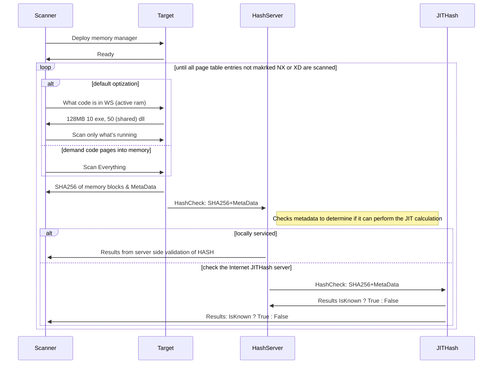
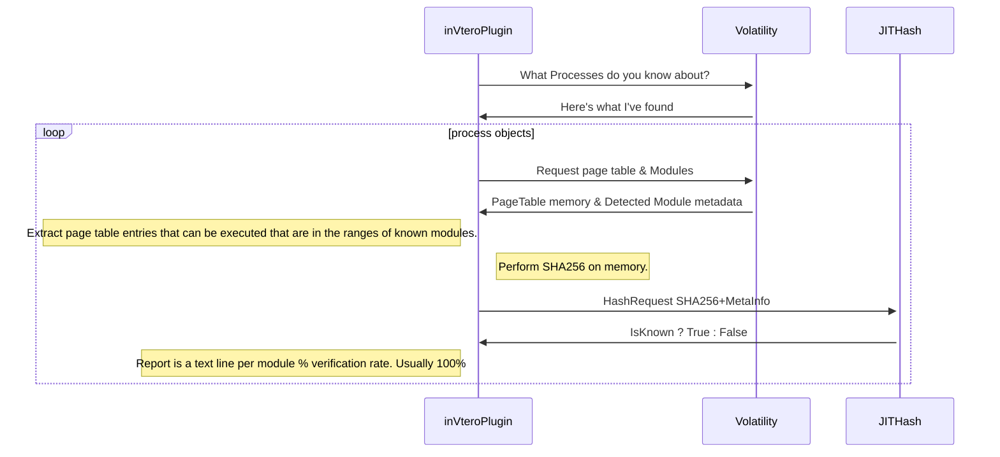

# 🔐 HashServer - Technical Documentation

> **📖 Main Documentation**: For general information, quick start, and usage examples, see the [main README](../README.md).

This document provides **advanced technical details** and **workflow diagrams** for HashServer implementation.

---

## 📚 Documentation Index

- **[Main README](../README.md)** - Overview, features, quick start, configuration
- **This Document** - Technical workflows, sequence diagrams, advanced concepts

---

## 🎯 Purpose

Hash server provides access to the largest hash database in the world (it's JIT (just in time) generated therefor infinitely sized 🚀) and combines that information with any personalized binary blobs you want to search for.

This system is part of a large set of projects including:
- [inVtero.net](https://github.com/K2/inVtero) (core version)
- [K2/Scripting](https://github.com/K2/Scripting) repository

**Target Use Cases:**
- 🔍 **Forensic analysis**
- 🚨 **Incident response**
- 🛡️ **Intrusion detection**

**Upcoming Features:**
- Dynamic code validation (JavaScript/JIT) - Next major release
- Submit issues to help guide development!

---

## 🎯 Design Goals

### ✅ Strong Integrity
You can be sure the results are not derived from a signature or AI/ML heuristic that can be fooled. We use cryptographic hashes (SHA256) for definitive binary verification.

### ⚡ Performance
- Multiple optimization techniques on client and server sides
- Scan only working set of live systems (configurable)
- Parallel server requests (performance improves with usage)
- Local and remote caching

### 🌐 Cross-Platform
- ✅ Windows (fully tested)
- ✅ Linux (fully tested)  
- ⚠️ macOS (should work, limited testing)

### 🛠️ Multi-Language
- **Script examples**: Bash, Python, PowerShell
- **Server implementation**: .NET Core
- **Client libraries**: Multiple languages supported

### 🎨 Ease of Use
- GUI tools (TreeMap, Hex Diff)
- Scripting support
- RESTful API

### 🌍 Free Public API
Internet HashServer pre-loaded with:
- Microsoft OS files
- Chrome datasets
- Mozilla datasets
- Selected GitHub projects (planned)

**API Endpoint**: `https://pdb2json.azurewebsites.net/`

---

## 🔬 Technical Workflows

### 1️⃣ Live Memory Scanning on Running Systems

**Primary Tool**: [Test-AllVirtualMemory.ps1](https://github.com/K2/Scripting/blob/master/Test-AllVirtualMemory.ps1)

**Configuration Example:**

```powershell
# Set this to your local HashServer to get the memory diffing
# The Internet server does not serve binaries, only local
# If you don't want to run a HashServer locally, set;
# $HashServerUri = $gRoot
$gRoot = "https://pdb2json.azurewebsites.net/api/PageHash/x"
# Set this to your local HashServer to get the memory diffing 
$HashServerUri = "http://10.0.0.118:3342/api/PageHash/x"
```

**What This Does:**
- ✅ Extract memory from target systems
- ✅ Compute SHA256 hashes of executable memory regions  
- ✅ Verify against HashServer (local + Internet fallback)
- ✅ Report known vs. unknown code

**Expected Results:**
- 🎯 **Near 100% verification** when local HashServer has your custom software
- 📊 **GUI and CLI reporting** of results
- 🔍 **Real-time analysis** of running systems

**Performance Notes:**
- Default: Scans only **working set** (active pages in RAM)
- Optional: Scan **all executable pages** (much slower, impacts user experience)
- Results vary per execution based on what's actively loaded

**Technology Stack:**
- Native PowerShell remoting sessions
- Invoke-Parallel for threading
- Code from @mattifestation (token elevation)
- ShowUI from JayKul
- TreeMap control from Proxb
- HexDiff control by K2

---

### 2️⃣ End-to-End Workflow: PowerShell Client

**Component Roles:**
- **Target**: System being scanned for integrity
- **Scanner**: Your desktop/host running the PowerShell script
- **HS (HashServer)**: Server with local/remote mount to known-good software
- **JITHash**: PDB2JSON Azure Function (cloud service)

**Sequence Diagram:**



---

**📊 Results Analysis:**

After scanning completes, analyze results using:

- **🗂️ TreeMap Control**:
  - Left-click to traverse: Process → Modules → Blocks
  - Visual representation of memory layout
  - Color-coded by verification status

- **🔍 Hex Diff Viewer**:
  - Right-click on a module to open
  - Shows precise byte-level modifications
  - Compare expected vs. actual memory

- **📷 Screenshots**: Available in [K2/Scripting repository](https://github.com/K2/Scripting)

---

### 3️⃣ End-to-End Workflow: Volatility Plugin / inVtero.core

**Static Memory Dump Analysis:**

- **Volatility Plugin**: Works with standard memory forensics workflow
- **inVtero.core**: More aggressive scanning, less tested
- **Use Case**: Post-incident analysis of memory dumps

**Status**: ⚠️ Testing in progress - contributions welcome!

**Plugin**: [inVteroJitHash.py](https://github.com/K2/Scripting/blob/master/inVteroJitHash.py)

---




## ⚙️ Advanced Configuration

> **💡 Tip**: See [Main README - Configuration](../README.md#%EF%B8%8F-configuration) for basic setup.

### Design Philosophy

**Goal**: Minimize administrative overhead
- ✅ Configure once, rarely update
- ❌ No hash database compilation or synchronization
- ✅ JIT computation replaces database maintenance
- ✅ Free Internet fallback for common binaries

### Golden Image Management

**Requirements:**
1. Provide local/network-accessible "golden" files
2. Files must match deployed binary versions exactly

**Workflow:**
1. Initial startup: Server indexes all files (cached)
2. Updates: Delete cache file, restart server
3. Performance: First startup slower, subsequent startups fast

**Development Status:**
- Current caching implementation works but has room for optimization
- Feedback welcome via GitHub Issues
- Major improvements planned with JS validation release

---

### 📋 Configuration Reference

> **📖 Full configuration**: See [Main README](../README.md#%EF%B8%8F-configuration)

**Critical Settings:**

| JSON Setting | Purpose | Notes |
|--------------|---------|-------|
| `FileLocateNfo` | 💾 **File index cache** | Speeds up startup. Delete and restart to refresh after golden image updates. |
| `GoldSourceFiles` | 📁 **Golden image array** | Not actual images - descriptors of file sets to scan |
| `Images[].OS` | 🏷️ **Metadata tag** | Identifies source of files (e.g., "Win10", "Ubuntu20") |
| `Images[].ROOT` | 📂 **Root scan path** | Recursively scanned. Can be any path with binaries. |
| `ProxyToExternalgRoot` | 🌐 **Internet fallback** | Enable to use public JITHash for unknown binaries |


```javascript
{
  "App": {
    "Host": {
      "Machine": "gRootServer",
      "FileLocateNfo": "GoldState.buf",
      "LogLevel": "Warning",
      "CertificateFile": "testCert.pfx",
      "CertificatePassword": "testPassword",
      "ThreadCount": 128,
      "MaxConcurrentConnections": 4096, 
      "ProxyToExternalgRoot": true,
      "BasePort": 3342
    },
    "External": {
      "gRoot": "https://pdb2json.azurewebsites.net/"
    },
    "Internal": {
      "gRoot": "http://*:3342/"
    },
    "InternalSSL": {
      "gRoot": "https://*:3343/"
    },
    "GoldSourceFiles": {
      "Images": [
        {
          "OS": "Win10",
          "ROOT": "t:\\"
        },
        {
          "OS": "Win2016",
          "ROOT": "K:\\"
        },
        {
          "OS": "MinRequirements",
          "ROOT": "C:\\Windows\\system32\\Drivers"
        }
      ]
    }
  }
}
```

---

## 🎯 Future Roadmap

### 🚀 Next Release: JavaScript/JIT Integrity

**Status**: 🔨 In Development

**Goal**: Dynamic code validation for JavaScript engines

**Approach**: Different from pure hash checks - analyzing JIT compilation

**Expected Outcome**: Near-perfect assurance level - making it infeasible to hide code within JIT from JavaScript hosts

---

## 💡 Advanced Concepts

### 🔐 Data Loss Prevention (DLP) Use Case

> **Abstract concept**: HashServer for content search without disclosure

#### The Security Problem with Traditional DLP

**Traditional DLP Risk:**
```
DLP System Memory → Contains search patterns/tokens → Attacker dumps memory → Discovers what to look for
```

**Result**: 🚨 You've disclosed your sensitive data markers to the attacker!

#### HashServer DLP Approach

**Key Benefit**: Search using **secure hash values** instead of plaintext patterns

**Advantage**: 
- ✅ Don't readily disclose what you're searching for
- ✅ Variably-sized blocks support content search
- ✅ Works with memory inputs or network streams
- ✅ Attacker can't reverse-engineer search patterns from hashes

#### Real-World Scenario

**Example**: Company using "Strategic Services Group" as sensitive document marker

**Traditional DLP:**
```
Attacker → Compromises DLP system → Dumps memory → Finds "Strategic Services Group" → Uses it for discovery
```

**HashServer DLP:**
```
Attacker → Compromises system → Dumps memory → Finds hashes → Cannot reverse-engineer markers
```

**Lesson**: 🛡️ **Don't expose your protection mechanisms to every perimeter node!**

Using hash-based scanning keeps your data classification schema private, even if the scanning system is compromised.

---

<div align="center">

**📖 [Return to Main Documentation](../README.md)**

</div>