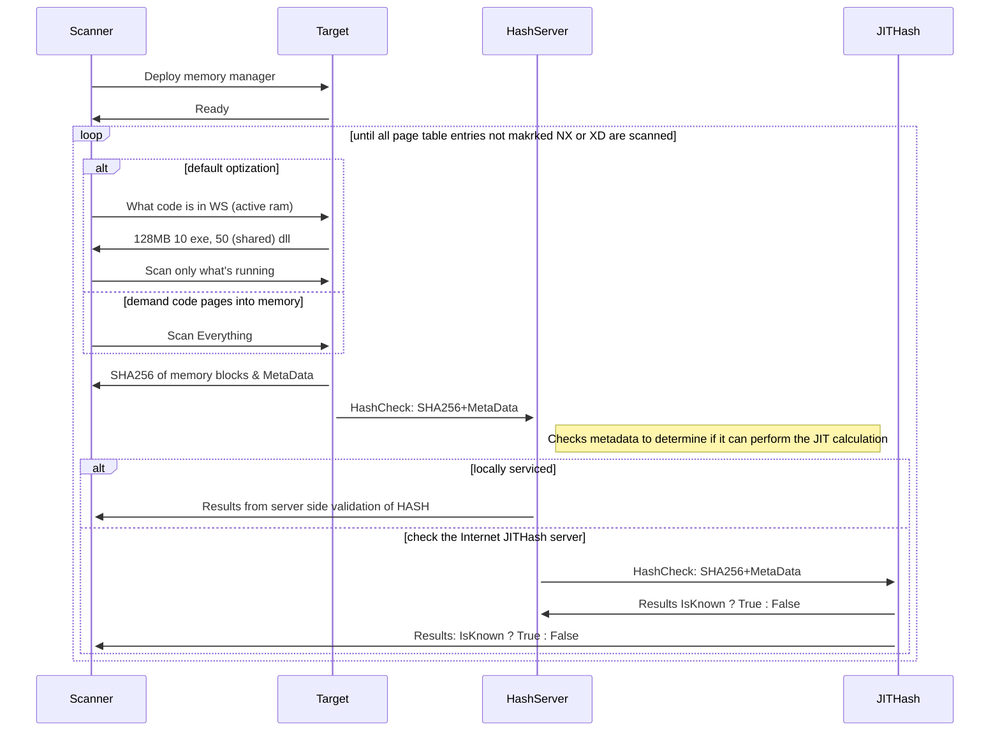
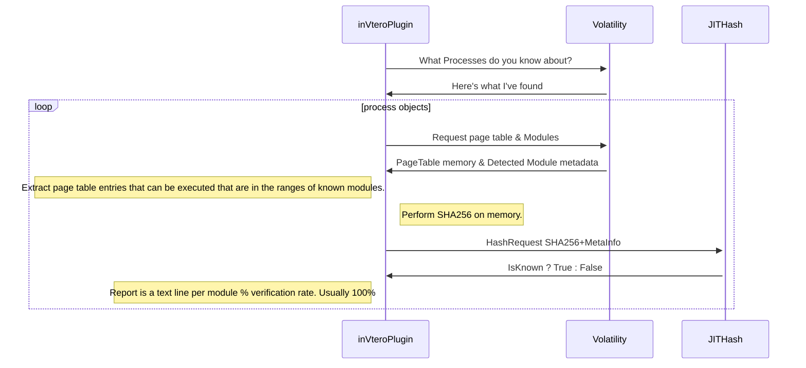

# HashServer

[TOC]

Hash server provides access to the largest hash database in the world (it's JIT (just in time) generated therefor infinitely sized :) and combines that information with any personalized binary blobs you want to search for.

This system is part of a large set of projects including invtero.net (core version also) and scripts in my scripting repository.

It's meant to deliver perfect results for hard problems in the space of **forensic analysis, incident response and intrusion detection.**

Upcoming support for dynamic code, (JavaScript) is the next big feature. Submit issues to this or any of the related projects to help out.

## HashServer goal - the validation integrity of code in memory 

- Strong integrity

  - You can be sure the results are not derived from a signature or AI or ML heuristic that can be fooled

- Performance

  - Varying techniques can be used to increase performance on the client or server sides
  - Scan only working set of live systems
  - Parallelize server requests (it get's faster the more it's used)
  - Local caching

- Cross platform

  - Windows and Linux tested
  - OSX should work (?:)

- Multi-Language

  - Script examples in; bash, python, PowerShell.
  - Code is .NET

- Ease of use (GUI's, Scripting)

- Free API access to Internet HashServer that is preloaded with most Microsoft OS files, Chrome and Mozilla data-sets

  - Considering selected github projects.  

  ​

## How does it work? (by example)

### Live memory on running system

Use [Test-AllVirtualMemory.ps1](https://github.com/K2/Scripting/blob/master/Test-AllVirtualMemory.ps1 ) and change it from using just the public HashServer to use your instance.

```powershell
# Set this to you're local HashServer to get the memory diffing
#The Internet server does not serve binaries, only local
# If you don't want to run a HashServer locally, set;
#$HashServerUri = $gRoot
$gRoot = "https://pdb2json.azurewebsites.net/api/PageHash/x"
# Set this to you're local HashServer to get the memory diffing 
$HashServerUri = "http://10.0.0.118:3342/api/PageHash/x"
```

After making this change, you can use the Test-AllVirtualMemory PS command to extract, verify and report (GUI and command line) the set of known vs. unknown code running in memory. 

The hit rate will be much higher than the public server alone since you can have all the files for you're custom software copied to a readable location to the server.  This way you should be able to attain **100% verification** if all the software you're using behaves well.

This is "real time" on running systems, the reporting may give you very different results from execution to execution since by default only the working set is polled.  You can alter this, however if the system is in-use by a local user, the negative effect on performance will be very noticeable :fist_oncoming:.

Test-AllVirtualMemory uses native PowerShell sessions, threading with Invoke-Parallel, portions of code from @mattifestation for obtaining System tokens ShowUI from JayKul a Treemap UI control from Proxb.  The HexDiff control is by K2  ( it's amazing PS has that sort of performance tbh :)

#### End to end interaction PowerShell

- **Target** is the system you are scanning
- **Scanner** is you're desktop or host that initiates running of the PowerShell script
- **HS** (HashServer) that has a (local or remote mount) to a set of folders with the software that you run that you know is good (i.e. copy the Program Files folders from a clean-install system to the network or disk of the HS)
- **JITHash** is the PDB2JSON Azure Function that's in the cloud


After the session is completed you can review the results by browsing the TreeMap control.  Left clicks traverse the tree from Process to Modules to Block levels.  Right clicking on a module level will reveal a 'diff' view in hex where you can view the precise bits that have been modified in memory.  Screenshots are available in the [Scripting repository]:.

#### End to end interaction python volatility plugin or inVtero.core

The volatility plugin is similar, it run's against static memory dumps, inVtero.core has a bit more aggressive envelope in terms of what it attempts to scan, however that code is less aggressively tested.

The inVtero Volatility plugin should work fine with HS.  More testing will happen soon.




## Details about configuring the HashServer

Major goals are to reduce the administrative overhead.  Using the HS you should be able to configure it one time and never worry about it very often (maybe fore updates:).   

There is no hash database to be compiled or keep synchronized.  This is a major time waste we're bypassing with the use of JIT computation and the free Internet based HashServer.

All you have to do is provide the a set of files locally or on a readable network share to the HashServer of the files you deem as **"golden"**.

Right now the HashServer has to be reloaded to index the file set, it does have some caching to speed up the cold start issues, however this stuff is still being worked out and I'm open to feedback.  I'll have some changes here in the next release when the JS code validation is completed.

### appsettings.json

Critical options to understand, the rest are pretty obvious or will be documented more later :)

| JSON                 | Meaning                                  |
| -------------------- | ---------------------------------------- |
| FileLocateNfo        | This is cached information about what files are available.  It's cached here so the cold startup time is faster.  If you have a lot of files it could be minutes before the server is ready.  Right now we do not have a good way to update this when you have file updates, if you update (overwrite) files in you're golden image set, just delete the cache NFO file and restart the server. |
| GoldSourceFiles      | Array of "Images" -- their not really images, but descriptors of file set's. |
| Images               | OS tag is metadata to indicate where the files came from.  The ROOT is the locator where to find the files, you might have any number of these they can be folders also "T:\AccountingApps\" or anything else as the folder is recursively scanned. |
| ProxyToExternalgRoot | Declares if you permit the HS to call the Internet JITHash or not, if you have sufficient resources locally to out perform when there are less service calls, let me know I'd love to hear about you're network. |


```javascript
{
  "App": {
    "Host": {
      "Machine": "gRootServer",
      "FileLocateNfo": "GoldState.buf",
      "LogLevel": "Warning",
      "CertificateFile": "testCert.pfx",
      "CertificatePassword": "testPassword",
      "ThreadCount": 128,
      "MaxConcurrentConnections": 4096, 
      "ProxyToExternalgRoot": true,
      "BasePort": 3342
    },
    "External": {
      "gRoot": "https://pdb2json.azurewebsites.net/"
    },
    "Internal": {
      "gRoot": "http://*:3342/"
    },
    "InternalSSL": {
      "gRoot": "https://*:3343/"
    },
    "GoldSourceFiles": {
      "Images": [
        {
          "OS": "Win10",
          "ROOT": "t:\\"
        },
        {
          "OS": "Win2016",
          "ROOT": "K:\\"
        },
        {
          "OS": "MinRequirements",
          "ROOT": "C:\\Windows\\system32\\Drivers"
        }
      ]
    }
  }
}
```

# TODO

Many things time is my enemy :rage:

Next version is the JS integrity checking, that will be a different model than pure hash checks but I believe nearly perfect level of assurance.  At least strong enough to make it infeasible to hide code within JIT from a JS host.

#### (Digression/Abstract thoughts) Using HS as DLP Content search

###### Don't drop you're pants to the perimeter!

In general, each block that is in the database is variably sized and allows for a content search.  It's flexible enough to support data loss prevention scanning systems that may import raw memory inputs or network streams for processing.  The benefit of using secure hash values for the scanning itself is that you do not *readily disclose what you are searching for* while you search for it.

If an attacker compromises a system in you're infrastructure and is undertaking their information gathering phase, if they were able to locate a data loss prevention system implemented by (most? all?) vendors, I've seen, they might just dump it's memory and discover an enclave of tokens that **enable the attacker** to **preform discovery** against your internal assets.

Let's pretend you're Uber and you just got hacked again, if an attacker were to determine you use a special marker for sensitive documents marked "Strategic Services Group" (you know, the one they did actually have ;). Then the attacker would know right away what to look for... you just dropped you're pats to every perimeter node, disclosed and exposed what you are attempting to protect in the first place. 